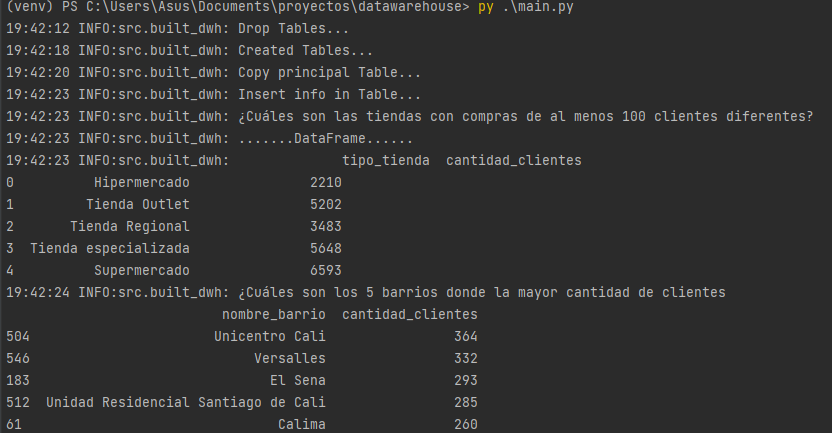

# Datawarehouse

### Este repositorio contiene la solución a la prueba de selección para el cargo de ingeniero de Datos en R5
Diseño

- compresión usando la recomendación analyze compression documentos;
- Distribucion con Redshift

Distribuir carga significa compartir esa carga de trabajo de una tabla de manera equitativa en los nodos, si no está distribuida correctamente, unos nodos trabajarán más que otros, y eso se traduce en consultas más lentas.

Distribución key: Determinada columna a mismas locaciones
• Mejora los joins y group by
• Los valores llave se almacenan juntos físicamente en cada nodo.

Distribucion ALL: Todos los datos se replican en cada nodo
• Se usa en tablas pequeñas
• Se distribuyen todos los datos de la tabla en cada nodo.
• Ocupa más espacio en disco y requiere más tiempo para actualizar, eliminar e insertar

Distrbucion Even: Distribución Roun’robin
• Úsala si no es posibl una partición tipo key
• La data se distribuye en todos los nodos y slides de manera rotativa


Redshift es una de ellas. Es una BD optimizada para lograr una recuperación rápida de columnas de datos,
normalmente en aplicaciones analíticas, esto permite procesar queries complejos de una manera óptima

Se construye una base de datos basada en columnas, la cual esta optimizada para procesos de analítica
permitiendo procesar grandes cantidades de información.

El secreto es repartir el trabajo, no se instala en un único servidor sino que se instala en un clúster(arreglos de varios servidores conectados {NODOS})




#!!! **Extra:** este repositorio se realizó con el objetivo de emular el desarrollo de un proyecto real, siguiendo
los lineamientos de la información que se encuentra en la rama de master, para su instalación y funcionamiento
se debe seguir los siguientes pasos:
- Clonar el repositorio

```git https://github.com/jdrincone/fraudes.git```

- Crear un entorno virtual e installar los requerimientos

```pip install -r requeriments.txt```

- Actualizar el modelo

```$ python actualizar_modelo.py```

- Levantar la api

