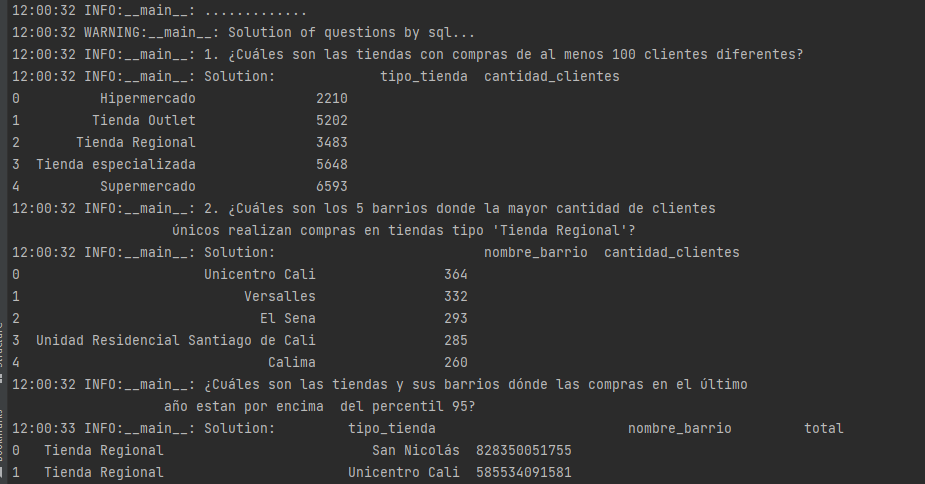

# Datawarehouse

#### Este repositorio contiene la solución a la prueba de selección para el cargo de ingeniero de Datos en R5

# Metodología y esquema

Se obta por la metodología de Kimball la cual se centra en el diseño dimensional, que implica organizar los datos 
en torno a entidades como dimensiones y hechos. Las dimensiones son los aspectos descriptivos de los datos,
como los clientes (documentos), ubicaciones (barrios), tiendas y fechas. Los hechos son los eventos medibles o transaccionales
como las compras realizadas por un cliente.
Esta metodología tiene un enfoque pragmático y orientado a las necesidades del negocio, centrandose en la entrega rápida
y agilidad de uso a los usuarios finales (lo cual lo veremos en un dasboard para la creación de indicadores al final 
de este reporte). Esta metodología tiene un enfoque iterativo e incremental, es decir, irá creciendo con el tiempo
dada las necesidades del negocio, por tanto una forma de trabajar de es escalable (o se desea que sea escalable) con 
el pasar del tiempo y el crecimiento de la empresa.

A continuación, se presentan los principales pasos de la metodología de Kimball para
la construcción de un data warehouse:


1.  Identificar el proceso empresarial. En nuestro caso tenemos datos de compras realizadas por cientes en tiendas
    ubicadas en algún lugar (cali) y tiempo (año 2022).
2. Diseñar el esquema dimensional. Las dimensiones y hechos se organizan en un esquema de estrella el cual se muestra
   a continuación.
   Dimensiones: documentos, tiempos, tiendas, barrios.
   Hechos: compras.


3. Diseñar proceso de ETL. En nuestro caso ya se tiene los datos de uso, los cuales se exploran inicialmente en un
   `src\notebook\datawarehouse.ipyn`, encontrandose que un cliente único se caracteriza por su número de documento y tipo
   de documento. De igual manera una tienda se identifica como única por su código tienda, latitud y longitud. Adicional,
   de la fecha de compra se puede obtener el año y el mes de compra como columnas separadas, lo cual será de utilidad 
   a lo usurios finales por ejemplo, para la creación de tableros. Con esta exploracción se identifica de forma apropiada
   las relaciones entre las tablas de dimensión y la tabla de hechos. Por último, los datos de entrada al
   datawarehouse se alojaran en el S3 y se creará una conexión entre el S3 y el motor usado el cual será Redshift que
   es una Base de datos columnar que permite la construcción de datawarehouse modernos.
4. Escoger como motor de base de datos Redshift ¿Por qué? Es una BD optimizada para lograr una recuperación 
   rápida de columnas de datos, con una gran aplicabilidad en proyectos de analítica, la DD permite procesar queries
   complejos de una manera óptima en la nube y de forma distribuida.
5. Desarrollar aplicaciones de informes: Crear aplicaciones de informes y dasbord de control que permitan 
   a los usuarios acceder y visualizar los datos almacenados y obtener estadísticos e indicadores de los datos. 

## Pipeline en Python que tome como input el dataset
Se construye este repositorio con el objetivo de automatizar completamente la construcción del Datrawarehouse,
el datawarehouse se construirá en Redshift con los recursos gratuitos permitidos por AWS.
Para que cualquier persona realice este ejercio puede clonar este repositorio y solicitar a `jdrincone@gmail.com` el
archivo de credenciales el cual se alojar en `input\cred.yaml` una vez que se clona el repositorio.

Pasos:
- Clonar el repositorio

```git https://github.com/jdrincone/fraudes.git```

- Crear un entorno virtual e installar los requerimientos

```pip install -r requeriments.txt```

- Adicionar archivo de credenciles
- Ejecutar

```$ python main.py```

### Pipeline
1. ``drop_tables`` Se eliminan tablas en caso de estar creadas
2. ``create_tables`` Se crea estructura de tablas de dimensiones y hechos, dado las caracteristicas de Redshift se usa sistema de compresión 
    y distribucción de informacción para aprovechar el computo distribuido en los cluster que tenemos.
3.   ``load_staging_tables`` Se copia información de trabajo desde el S3 a RedShift.
4. ``insert_info_to_table`` Agrega información a las tablas de dimensiones y hechos dado el esquema del punto anterior.
5. ``Solution of questions by sql`` Se responden las preguntas del punto 3 usando sql y se genera una pregunta adicional.
6. ``Solution of questions by pandas`` Se responden las preguntas del punto 3 usando full python  y se genera una pregunta adicional.
7. ``Generación de tablero en Power BI`` Se conecta Power BI con el datawarehouse en Redshift y se responde de forma dinámica las preguntas del punto 3.

### Preguntas:
- ¿Cuáles son las tiendas con compras de al menos 100 clientes diferentes?
- 
- ¿Cuáles son los 5 barrios donde la mayor cantidad de clientes únicos realizan compras en tiendas tipo 'Tienda Regional'?
-  
- ¿Cuáles son las tiendas y sus barrios dónde las compras en el último año estan por enciema 
    del percentil 95?
 

La respuesta a todas estas preguntas se pueden obtener en consola al ejecutar `main.py`
 
o directamente de forma dinámica en el tablero de Power BI  `clientes.pbix`
 
