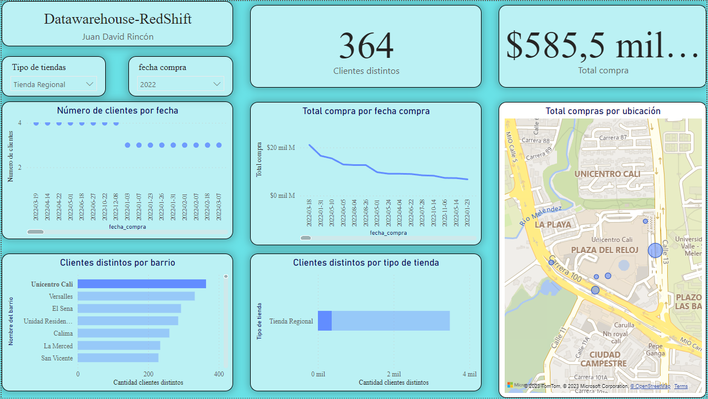

# Datawarehouse

### Este repositorio contiene la solución a la prueba de selección para el cargo de ingeniero de Datos en R5





#!!! **Extra:** este repositorio se realizó con el objetivo de emular el desarrollo de un proyecto real, siguiendo
los lineamientos de la información que se encuentra en la rama de master, para su instalación y funcionamiento
se debe seguir los siguientes pasos:
- Clonar el repositorio

```git https://github.com/jdrincone/fraudes.git```

- Crear un entorno virtual e installar los requerimientos

```pip install -r requeriments.txt```

- Actualizar el modelo

```$ python actualizar_modelo.py```

- Levantar la api

